# terraform-azure-virtual-machine-windows

Production-ready Terraform module for deploying Azure Windows Virtual Machines with managed disks, extensions (antimalware, monitoring, Azure AD login), availability sets/zones, proximity placement groups, boot diagnostics, and backup integration.

## Architecture

```mermaid
flowchart TD
    A[Windows Virtual Machine] --> B[OS Disk]
    A --> C[Data Disks]
    A --> D[Network Interface]
    A --> E[Extensions]
    A --> F[Boot Diagnostics]
    A --> G[Managed Identity]
    A --> H[Backup Protection]
    D --> I[Public IP]
    D --> J[Subnet / VNet]
    E --> K[Antimalware]
    E --> L[Azure Monitor Agent]
    E --> M[Azure AD Login]
    E --> N[Custom Extensions]
    A --> O[Availability Set / Zone]
    A --> P[Proximity Placement Group]

    style A fill:#0078D4,stroke:#005A9E,color:#FFFFFF
    style B fill:#50E6FF,stroke:#0078D4,color:#000000
    style C fill:#50E6FF,stroke:#0078D4,color:#000000
    style D fill:#FFB900,stroke:#FF8C00,color:#000000
    style E fill:#FF6F61,stroke:#D44942,color:#FFFFFF
    style F fill:#B4A0FF,stroke:#8661C5,color:#000000
    style G fill:#00CC6A,stroke:#009E52,color:#FFFFFF
    style H fill:#E74856,stroke:#C13239,color:#FFFFFF
    style I fill:#FFD700,stroke:#CCB200,color:#000000
    style J fill:#7FBA00,stroke:#5E8C00,color:#FFFFFF
    style K fill:#FF4F4F,stroke:#CC3333,color:#FFFFFF
    style L fill:#9B59B6,stroke:#7D3C98,color:#FFFFFF
    style M fill:#00B7C3,stroke:#008B94,color:#FFFFFF
    style N fill:#FF9F00,stroke:#CC7F00,color:#000000
    style O fill:#00CC6A,stroke:#009E52,color:#FFFFFF
    style P fill:#00CC6A,stroke:#009E52,color:#FFFFFF
```



## Features

- Windows VM with configurable size, image, and OS disk settings
- Automatic NIC and optional public IP creation
- Multiple managed data disks with configurable caching and storage types
- Availability set or availability zone placement
- Proximity placement group support
- Microsoft Antimalware extension with configurable scan settings
- Azure Monitor Agent extension for monitoring
- Azure AD Login extension for AAD-based authentication
- Custom VM extension support
- Boot diagnostics with managed or custom storage
- Managed identity support (SystemAssigned and UserAssigned)
- Azure Backup integration with Recovery Services Vault
- Trusted Launch support (Secure Boot and vTPM)
- Host encryption support
- Azure Hybrid Benefit licensing
- WinRM listener configuration
- Configurable patching mode and assessment

## Usage

```hcl
module "windows_vm" {
  source = "path/to/terraform-azure-virtual-machine-windows"

  name                = "vm-myapp-01"
  resource_group_name = "rg-myapp"
  location            = "East US"
  size                = "Standard_D4s_v3"
  admin_username      = "azureadmin"
  admin_password      = var.vm_password
  subnet_id           = azurerm_subnet.vms.id

  data_disks = {
    "data" = {
      disk_size_gb = 128
      lun          = 0
    }
  }

  tags = {
    Environment = "production"
  }
}
```

## Examples

- [Basic](./examples/basic/) - Simple VM with default settings
- [Advanced](./examples/advanced/) - Availability set, data disks, extensions, and monitoring
- [Complete](./examples/complete/) - Full production setup with zones, encryption, backup, and all extensions

## Requirements

| Name | Version |
|------|---------|
| terraform | >= 1.3.0 |
| azurerm | >= 3.80.0 |

## Inputs

| Name | Description | Type | Default | Required |
|------|-------------|------|---------|----------|
| name | VM name (max 15 chars) | `string` | n/a | yes |
| resource_group_name | Resource group name | `string` | n/a | yes |
| location | Azure region | `string` | n/a | yes |
| size | VM SKU size | `string` | `"Standard_D2s_v3"` | no |
| admin_username | Admin username | `string` | n/a | yes |
| admin_password | Admin password | `string` | n/a | yes |
| subnet_id | Subnet ID for auto-created NIC | `string` | `null` | no |
| source_image_reference | Image reference | `object` | Windows Server 2022 | no |
| os_disk | OS disk configuration | `object` | Premium_LRS | no |
| data_disks | Map of data disks | `map(object)` | `{}` | no |
| zone | Availability zone | `string` | `null` | no |
| availability_set_id | Availability set ID | `string` | `null` | no |
| enable_antimalware_extension | Enable antimalware | `bool` | `false` | no |
| enable_monitoring_extension | Enable Azure Monitor | `bool` | `false` | no |
| enable_azure_ad_login | Enable AAD login | `bool` | `false` | no |
| backup_policy_id | Backup policy ID | `string` | `null` | no |
| tags | Tags to assign | `map(string)` | `{}` | no |

## Outputs

| Name | Description |
|------|-------------|
| vm_id | The ID of the VM |
| vm_name | The name of the VM |
| private_ip_address | Primary private IP |
| public_ip_address | Primary public IP |
| identity | Identity block |
| data_disk_ids | Map of data disk names to IDs |

## License

MIT License - see [LICENSE](./LICENSE) for details.
